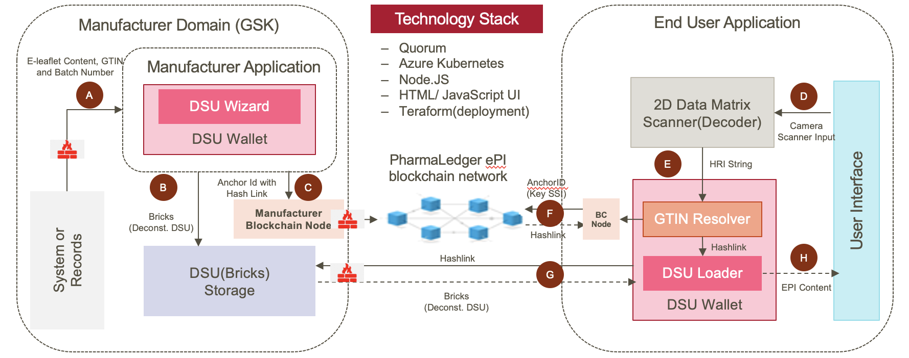

Introduction
=======================
In the solution overview section, you need to briefly introduce the solution in a couple of paragraphs, 
describing the functioning of the solution and its different components at a very high level.
It's nice to add a high-level block diagram showing various components in one place.

.. toctree::
   :maxdepth: 1

   solutionOverview/purpose
   solutionOverview/scope
   solutionOverview/assumptions
   solutionOverview/constraints
   solutionOverview/dependencies
   solutionOverview/key_decisions

